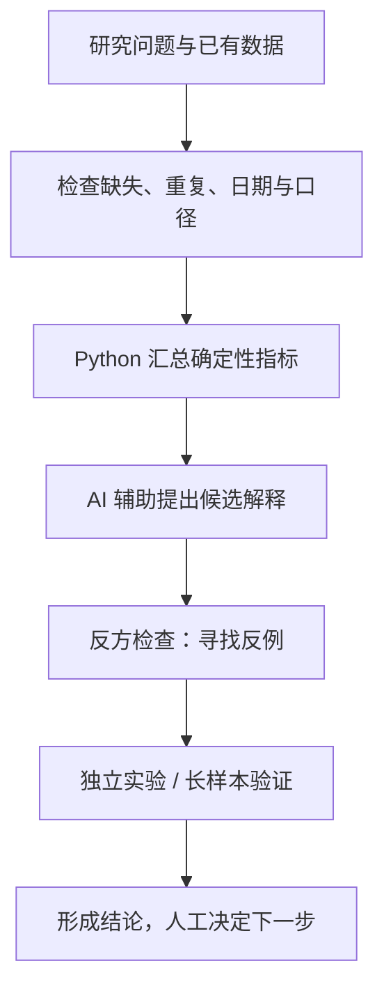

# Codex Trading Agents

**AI Agent 辅助策略研究与分析。** AI 帮助提出假设和寻找反例，Python 计算关键数值，人工决定下一步。

## 先跑一个例子

Python 3.11+，在仓库根目录运行：

```bash
python main.py demo
```

无需依赖、密钥或模型。打开返回的 `report.md`，查看数据缺口、指标和结论。
示例使用[合成数据](examples/diagnosis/README.md)，不是真实收益或实验成绩。
使用自己的数据见[上手指南](docs/quickstart.md)。

## 分析流程



统一入口提供数据检查、健康统计、报告和可选 AI 解释。独立实验与策略晋级由人工组织，不会自动执行。

| 已有能力 | 实现与说明 |
|---|---|
| 健康诊断、扫描与模拟记录 | [诊断入口](main.py)、[扫描器](src/market_scanner.py)、[运行指南](docs/quickstart.md#原有每日入口) |
| 因子、分组、相关性、消融与回测 | [研究导航](research/README.md) |
| 候选假设、反方检查与报告文字 | [受控 AI 调用](docs/controlled_agents.md)、[飞书报告](docs/feishu_reports.md) |
| 回答格式与规则检查 | [Eval](eval/README.md)，全文事实仍需人工评审 |

## 展示重点与边界

[真实案例](docs/case_study_strategy_diagnosis.md)记录了一个早期表现不错的候选如何被后续证据降级。项目展示可验证的分析过程，尚未证明稳定有效的策略；[历史修正](docs/README.md#历史研究)保留完整记录。

默认不调用模型、不连接实盘、不自动下单。AI 不编造数据、不决定晋级；重要策略变化须经过独立实验、历史验证和人工确认。权限限制见 [Harness](docs/agent_harness.md)。

**阅读顺序：** [上手](docs/quickstart.md) → [分析方法](docs/analysis_methodology.md) → [真实案例](docs/case_study_strategy_diagnosis.md)。其余内容在[文档导航](docs/README.md)。
