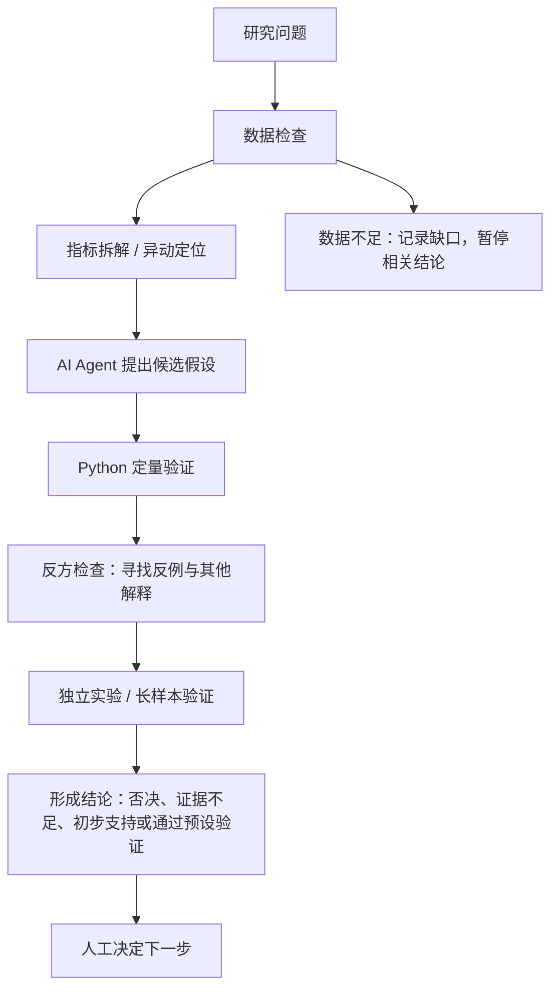

# Codex Trading Agents

**AI Agent 辅助的策略研究与分析工作流。**

项目探索如何让 AI Agent 参与数据分析和策略研究：通过数据检查、指标诊断、假设生成、Python 定量验证、反方检查和人工确认，把开放式研究问题转化为可验证、可复盘的分析流程。

AI 主要帮助理解问题、提出分析方向和整理结果；收益率、相关性、分组表现等关键数值，统一由确定性 Python 程序计算和验证。A 股策略研究是这里的应用场景，项目成果是分析方法、研究代码和可追溯的判断过程。

## 分析流程

**AI 提出假设，程序验证结论。**



这是组织研究的工作方法，尚不是一条自动运行所有步骤的 Agent 流水线。现有 Python 脚本完成计算；Hermes 提供诊断、反方审查和实验草案；研究人员选择验证方式并审核结果。详细步骤见[分析方法](docs/analysis_methodology.md)。

## AI 在这个项目里做什么

- 帮助拆解开放式分析问题，提出候选假设。
- 整理多份分析结果，协助生成中文报告。
- 提醒可能遗漏的反例，建议下一项独立验证。

对应实现与约定：[Hermes 诊断 Prompt](prompts/strategy_steward_agent.md)、[多模式运行脚本](scripts/run_strategy_steward.sh)、[综合观察 Prompt](prompts/synthesis_agent.md)。

## AI 不直接做什么

- 不负责最终数值计算，不编造缺失数据。
- 不把相关性直接解释为因果关系。
- 不直接决定策略晋级，不未经验证修改主策略。
- 不连接实盘交易，不自动下单。

这些是[项目规则](AGENTS.md)；其中人工审批和只读要求主要是行为约束，尚无统一的强制权限沙箱，详见 [Agent Harness](docs/agent_harness.md)。

## 已有能力与证据

| 分析环节 | 仓库中的实现 | 能证明什么 / 边界 |
|---|---|---|
| 数据获取与检查 | [data_fetcher.py](src/data_fetcher.py)、[data_expansion_pipeline.py](research/data_expansion_pipeline.py) | 行情抓取、缓存、缺失/重复/日期覆盖与数据源一致性检查；覆盖范围取决于实际输入 |
| 每日扫描与模拟计划 | [market_scanner.py](src/market_scanner.py)、[main_v2.py](main_v2.py) | 固定规则生成候选、触发区间、止损和仓位，用于模拟复盘 |
| 因子研究 | [factor_research.py](research/factor_research.py)、[研究说明](docs/factor_research.md) | IC/RankIC（因子值/排名与后续收益的相关程度）、分组收益、因子相关性、消融对照；相关不代表因果 |
| 策略健康诊断 | [strategy_health.py](src/strategy_health.py)、[reviewer.py](src/reviewer.py) | 5/20/60 日窗口的触发、止损、止盈、已平仓表现及标签/市场环境差异；小样本提示不足 |
| 历史与长样本验证 | [扩展回测](research/backtest_v3_expanded.py)、[面板回测器](research/panel_backtester.py)、[搜索协议](research/strategy_search_202607.py) | 时间切片、成本和交易限制、独立对照、试验登记；历史收益不是未来承诺 |
| 影子实验与反方检查 | [Hermes 说明](docs/hermes.md)、[实验目录说明](strategy_experiments/README.md) | daily/deep/critic/experiment 四种模式；草案需另行运行 Python 验证 |
| 前向模拟观察 | [冻结 V3 记录](src/forward_paper_trading_v3.py)、[研究观察入口](research/README.md)、[观察工作流](.github/workflows/daily-forward-observation.yml) | 固定规则逐日积累新样本，记录不等于策略晋级 |
| 报告、日志与学习记录 | [reporter.py](src/reporter.py)、[strategy_learning.py](src/strategy_learning.py)、[notifier.py](src/notifier.py) | 文件化报告、确定性经验记录与可选推送；“学习”不是更新模型权重 |
| 最小规则评测 | [eval/](eval/README.md) | 固定案例、结构和规则检查；没有真实模型调用时不报告 Agent 通过率 |

## 一个真实案例：漂亮的早期结果为何需要否决

恐慌反弹候选 `idx1000_bounce_h5` 曾在三个历史区间都为正，但只有 12 次事件；反方检查发现选股规则没有显著增量证据，后来 2016–2020 加长段也未支持其稳定性。历史记录将其降为“仅记录、不调参、不下策略结论”。

见[策略诊断案例](docs/case_study_strategy_diagnosis.md)：从问题、候选解释到随机对照、口径修正和长样本复检。案例引用仓库历史报告，本次没有重新运行这些实验。

## 研究现状与历史修正

阅读历史研究时，应沿着后续修正阅读，不能只引用早期摘要：

- 2026-06 的[项目状态报告](docs/project_status_report.md)记录了短样本升级审计；它不证明长期有效。
- [V3 重审](docs/v3_reaudit_2026-07-03.md)纠正了旧指数失真影响。因此，旧首页引用的 V3 累计约 -9.89% 不再作为有效结论展示；修正也没有证明 V3 有效。
- [搜索报告](docs/strategy_search_2026-07_report.md)要连同反方增补、真复权及时变 ST 终审阅读；[加长复检](docs/panel_v2_extended_recheck_2026-07-09.md)进一步否定了“三段全正即可晋级”的推断。
- 后续[红利低波研究及 7 月 21 日补遗](docs/dividend_lowvol_verdict_2026-07-10.md)、[可转债研究](docs/cb_double_low_verdict_2026-07-12.md)也记录过正的历史表现，但各自未通过预设标准。因此不能笼统写成“所有策略都亏损”，也不能把局部正结果写成已验证策略。

以上是有日期的研究档案；本次整理未重新取得完整历史数据或更新前向统计。项目保留负结果、数据错误及修正过程，不以收益率作为展示成绩。

## 项目结构与实际运行方式

```text
main_v2.py              自选股日报；默认 Python + 模板，可选 --llm
src/                    日报、扫描、复盘、健康监控、V3 模拟记录
research/               因子、回测、独立研究及后续前向观察脚本
archive/                旧入口与旧策略，保留对照和手动回滚依据
prompts/                分析调用、综合观察、复盘、Hermes 模式约定
scripts/                shell 入口与 Hermes 调用
strategy_experiments/   实验草案说明；生成草案默认忽略
forward_state/          既有前向观察记录与冻结协议
docs/                   分析方法、案例、历史研究、操作说明
eval/                   独立的流程规则评测，不进入每日扫描路径
```

主日报层继续保持 `src/` 不导入 `research/`。后续独立前向观察工作流已经调用 `research/forward_*.py`，不能再把早期“三层隔离”说明理解为所有定时任务都只调用 `src/`。历史重构见[重构说明](docs/refactor_2026-07-03.md)，本次核对见[审计说明](docs/agent_analysis_audit.md)。

## 快速开始

只查看方法与运行最小评测，无需行情数据、密钥或模型服务（Python 3.11+，标准库）：

```bash
python eval/run_eval.py
python -m unittest discover -s eval -p "test_*.py"
```

第一条默认只校验案例定义，报告 `agent_evaluated: false`，不代表 Agent 测试通过。导入真实回答与人工评审方法见 [Eval 说明](eval/README.md)。

运行原有行情分析环境建议 Python 3.12，与[现有 CI](.github/workflows/ci.yml)一致：

```bash
python3.12 -m venv .venv
source .venv/bin/activate
python -m pip install -r requirements.txt
cp .env.example .env
```

Windows PowerShell 激活命令为 `.venv\Scripts\Activate.ps1`，复制模板用 `Copy-Item .env.example .env`。已有 `.env` 时跳过复制。按[配置模板](.env.example)填入本地环境变量；密钥不进入版本控制。

## 常用入口

以下命令从仓库根目录运行；行情入口可能访问外部数据源并生成本地产物，历史研究需要另行准备缓存或面板数据。`--push-dry-run` 仅模拟消息推送，不代表整个分析离线。

```bash
python main_v2.py
python src/market_scanner.py
python src/market_scanner.py --push --push-dry-run
python src/scheduled_v3_reporter.py
python src/forward_paper_trading_v3.py
```

Hermes 需要本机 CLI、模型配置和指定日期的健康/复盘输入；`--dry-run` 只组装 Prompt，不调用模型：

```bash
scripts/run_strategy_steward.sh --date YYYY-MM-DD --dry-run
scripts/run_strategy_steward.sh --date YYYY-MM-DD --mode daily
scripts/run_strategy_steward.sh --date YYYY-MM-DD --mode critic
scripts/run_strategy_steward.sh --date YYYY-MM-DD --mode experiment
```

研究入口与数据要求见[因子研究](docs/factor_research.md)、[research/README.md](research/README.md)；推送配置见[推送说明](docs/push.md)。研究脚本按用途手动运行，不因改写项目定位而重新调参。

## 配置、产物与运行边界

- 配置：[watchlist.json](watchlist.json)、[strategy.json](strategy.json)、[freeze_v3_strategy.json](freeze_v3_strategy.json)。重要策略变化需独立实验、历史验证和人工确认；[回滚指南](docs/rollback_guide.md)是手动恢复说明，不是自动回滚服务。
- 日报产物写入 `output/YYYY-MM-DD/`；行情缓存、主模拟台账、学习记录分别在 `data/cache/`、`data/ledger/`、`data/strategy_learning/`；运行日志在 `logs/`。这些运行目录由 [.gitignore](.gitignore) 排除。
- `strategy_experiments/YYYY-MM-DD/` 存放本地草案，默认忽略；已有 `forward_state/` 观察记录由独立工作流跟踪提交，不能泛称所有台账都不入 Git。本次不增加任何私人记录。
- [V3 日报工作流](.github/workflows/daily-v3-feishu-push.yml)安排工作日北京时间 19:10；[前向观察工作流](.github/workflows/daily-forward-observation.yml)安排 19:40、21:30。这里只说明配置，不保证在线运行状态。
- [自选股分析](.github/workflows/daily-analysis.yml)和[市场扫描](.github/workflows/daily-market-scan.yml)为手动备用工作流。消息推送使用环境变量或 Actions Secrets。

## 建议阅读顺序

1. [分析方法](docs/analysis_methodology.md)：怎样把问题变成可以验证的假设。
2. [真实案例](docs/case_study_strategy_diagnosis.md)：怎样否决证据不足的方向。
3. [Agent Harness](docs/agent_harness.md)：规则、代码机制与人工责任分别在哪里。
4. [最小 Eval](eval/README.md)：怎样检查流程守规矩，哪些判断尚未自动化。
