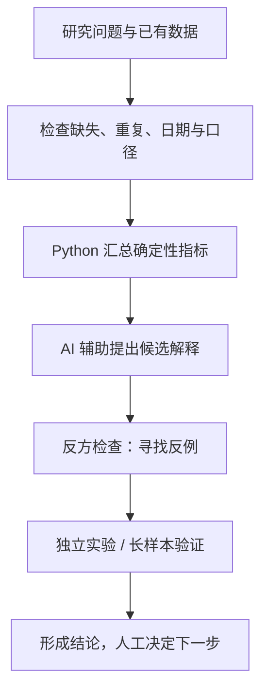

# Codex Trading Agents

**AI Agent 辅助的策略研究与分析工作流。**

从数据检查、指标拆解、候选假设到反方检查和人工确认，把开放式问题变成可验证、可复盘的分析过程。**AI 提出假设，Python 计算和验证数值，人工决定下一步。**

## 从这里开始：运行一次策略健康诊断

在仓库根目录，使用 Python 3.11+：

```bash
python main.py demo
```

无需安装依赖、配置密钥或连接模型。打开命令返回的 `report.md`，你会看到：

1. **数据检查：** 三条合成复盘中有一条数据缺失。
2. **Python 指标：** 两条合成归档的平均净收益为 -1%，程序否决“这组样本平均净收益为正”的陈述。
3. **结论边界：** 样本不足，无法判断策略稳定性；AI 解释和人工决定仍待补充。

示例数据完全是[教学合成材料](examples/diagnosis/README.md)，不是历史收益或真实实验。程序没有把模板文字冒充 AI 回答。

用已有每日复盘生成诊断：

```bash
python main.py diagnose --date 2026-09-15
```

默认读取已有复盘和模拟归档，不抓取行情、不推送消息。没有输入时输出“数据不足”报告。数据路径、AI 回答导入和结果说明见[五分钟上手](docs/quickstart.md)。

## 一次分析怎样完成



当前统一入口完成数据检查、Python 健康统计、AI 任务材料准备和报告输出；可导入 AI 的候选解释与反方意见。独立实验、长期有效性验证和策略变更仍是后续人工组织的研究，不会因生成报告而自动发生。

## 各部分负责什么

| 部分 | 职责与代码依据 |
|---|---|
| 任务入口 | [main.py](main.py) 串联一次诊断；[diagnosis.py](src/diagnosis.py)保存事实、报告、任务材料和日志 |
| Python 分析 | [strategy_health.py](src/strategy_health.py)复用原有窗口统计；[因子研究](docs/factor_research.md)保留 IC/RankIC、分组、相关性与消融 |
| AI 辅助 | [Steward Prompt](prompts/strategy_steward_agent.md)约定假设和反方检查；导入文字须人工核对，不覆盖程序数值 |
| 人工决策 | [项目规则](AGENTS.md)要求独立实验、历史验证和人工确认后才讨论重要策略变化 |

AI 可以帮助拆解问题、整理结果、生成报告文字和寻找反例；它不负责最终数值计算，不编造缺失数据，不把相关直接当因果，也不自动决定策略晋级。本项目不连接实盘、不自动下单。

## 按用途阅读

| 想做什么 | 从哪里开始 |
|---|---|
| 五分钟跑通与理解主流程 | [上手指南](docs/quickstart.md) |
| 学习分析方法 | [分析方法](docs/analysis_methodology.md) |
| 看一个真实的失败假设如何被否决 | [恐慌反弹诊断案例](docs/case_study_strategy_diagnosis.md) |
| 找研究工具或历史实验 | [研究导航](research/README.md) |
| 运行已有日报、扫描、前向观察 | [运行入口说明](docs/quickstart.md#原有每日入口) |
| 理解权限、日志和人工边界 | [Harness](docs/agent_harness.md) |
| 检查分析回答是否守规则 | [最小 Eval](eval/README.md) |
| 查全部文档与历史修正 | [文档导航](docs/README.md) |

## 研究现状与诚实边界

真实案例中，恐慌反弹候选早期三个历史区间为正，但事件样本很少；随机对照与加长样本没有支持稳定性，因此降为仅观察。完整过程和证据见[案例](docs/case_study_strategy_diagnosis.md)。

早期 V3 数字已被[后续重审](docs/v3_reaudit_2026-07-03.md)纠正；后续红利、可转债研究虽有正的历史结果，也未通过各自预设标准。[文档导航](docs/README.md)按修正顺序组织证据。项目保留历史研究，不宣称已经找到稳定有效的策略。

当前 Eval 自动检查的是格式和结构化规则；文字是否歪曲事实仍需人工评审，没有真实模型通过率。统一诊断不调用模型；旧 Claude/Hermes CLI 路径的只读要求主要靠规则约束，尚无统一强制沙箱。

## 开发验证

```bash
python -m pip install pandas numpy requests certifi
python -m unittest discover -s tests -p "test_*.py"
python eval/run_eval.py
python -m unittest discover -s eval -p "test_*.py"
```

原有行情环境与引擎测试的依赖见[上手指南](docs/quickstart.md)。诊断产物存入 `output/diagnosis/`，每次新建目录；密钥和本地运行产物按 [.gitignore](.gitignore) 忽略。原有配置、日报入口、冻结规则与前向观察记录保留。

维护扫描逻辑时，按[扫描器职责说明](docs/scanner_refactor.md)查找数据、规则、回测、台账或报告模块；原扫描命令和历史函数导入保持兼容。
